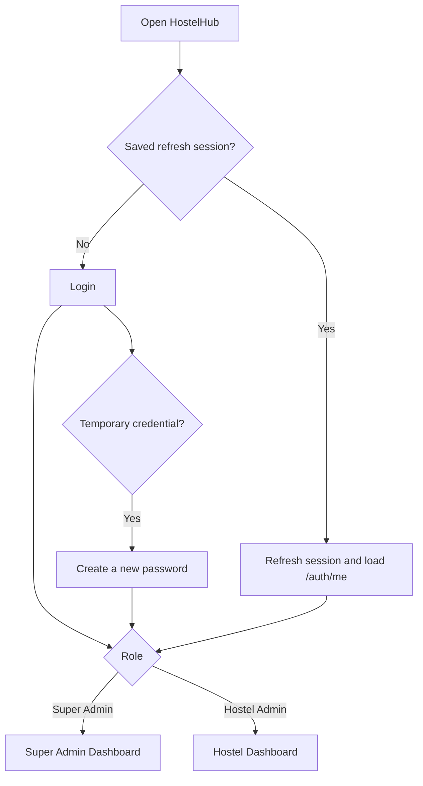

# HostelHub Multi-User SaaS Development Plan

## 1. Goal and recommended account model

HostelHub should become one shared SaaS platform with two primary roles:

- **Super Admin** manages customer hostel accounts, creates their first administrator, activates or suspends access, resets access, and sees platform-level usage.
- **Hostel Admin** manages only their own hostel organization: branches, rooms, residents, admissions, bookings, payments, documents, settings, and notifications.

The recommended SaaS boundary is a **Hostel Organization** (also called a workspace in the code). The existing `Branch` model remains a physical hostel location. One organization can therefore have one branch or several branches without mixing its data with another customer.

Use the term `organizationId` in code because the application already uses `Tenant` to mean a resident. Calling the SaaS customer a tenant would make the data model confusing.

### Initial scope

- One or more `HOSTEL_ADMIN` users may belong to one organization.
- A Hostel Admin sees all branches in their organization.
- A `SUPER_ADMIN` does not belong to a hostel organization.
- Public admission and payment pages remain available without login, but every request remains bound to one active organization through its branch and secure token.
- Subscription collection and automated SaaS billing are outside the first release. The schema can store a plan and account status so billing can be added later.

### Optional later role

Add `BRANCH_MANAGER` only if a customer needs staff who can access selected branches. This needs a `BranchMembership` table and branch-level permission checks. It should not delay the first multi-tenant release.

### Permission matrix for the first release

| Capability | Super Admin | Hostel Admin |
|---|---:|---:|
| View platform totals and organizations | Yes | No |
| Create, activate, suspend, or archive an organization | Yes | No |
| Create/reset/suspend a hostel administrator | Yes | No |
| Set organization plan and limits | Yes | No |
| View organization usage counts | Yes | Own organization only |
| View resident/Aadhaar/payment details | No by default | Own organization only |
| Manage branches and rooms | No | Own organization only |
| Manage admissions, bookings, residents, and rent | No | Own organization only |
| Change organization payment settings | No | Own organization only |
| Change own name, email, password, and sessions | Yes | Yes |
| View platform audit events | Yes | No |

Keeping resident personal data out of normal Super Admin screens reduces privacy exposure. A future support-access feature should be explicit, temporary, visible, and audited.

## 2. Current application status

### What already helps the migration

- MongoDB and Prisma already have a `User` model with email, password, name, and role fields.
- Every branch currently belongs to a user through `Branch.userId`.
- Rooms, residents, applications, payments, and documents can already be traced to a branch.
- Most controllers check ownership using the authenticated user's ID or `branch.userId`.
- Bookings, settings, notifications, and push tokens already store a user ID.
- Password hashing and JWT libraries are installed.
- Public admission links and secure form tokens are already branch-specific.

### Current blockers and risks

The application is still running in single-owner mode even though `FEATURES.md` describes a complete authentication system.

- The backend accepts a missing or invalid JWT and silently loads one configured owner.
- The backend contains fallback credentials and a fallback JWT secret.
- There are no login, logout, refresh-token, password-change, password-reset, or current-user API routes.
- The mobile `AuthContext` always returns a hard-coded owner.
- The mobile API client does not attach an access token.
- The splash screen fetches hostel data before an authentication session exists.
- The Settings screen says the installation is made for one owner and has no real logout or password management.
- The `role` value is not currently enforced by route middleware.
- Ownership rules are repeated across controllers rather than enforced through a central organization scope.
- Settings mix organization data, such as payment details, with personal preferences, such as dismissed alerts.
- There is no audit trail for administrator creation, password resets, suspension, or sensitive data changes.
- Render currently runs `prisma db push` on every backend start. The SaaS migration needs an explicit, verified data migration rather than relying only on startup schema synchronization.

The existing owner filtering is a useful base, but strict authentication must be enabled before a second hostel organization is created.

## 3. Target data model

### Organization

Add an `Organization` model containing:

- `id`
- `name`
- `slug` (unique, URL-safe internal identifier)
- `status`: `ACTIVE`, `SUSPENDED`, or `ARCHIVED`
- `contactName`, `contactPhone`, and `contactEmail`
- `plan`: initially `FREE`, `STANDARD`, or `PREMIUM`, managed manually
- optional `trialEndsAt`, `maxBranches`, and `maxBeds`
- `createdByUserId` for the Super Admin who created it
- timestamps

### User

Change `User` to contain:

- `organizationId`, nullable only for a Super Admin
- normalized, globally unique email
- `passwordHash` (rename the current `password` field during migration)
- role enum: `SUPER_ADMIN` or `HOSTEL_ADMIN`
- status: `ACTIVE`, `INVITED`, or `SUSPENDED`
- `mustChangePassword`
- `passwordChangedAt`
- `tokenVersion` for immediately revoking all sessions
- `lastLoginAt`
- timestamps

Passwords must never be readable by the Super Admin. The Super Admin can create a one-time setup link or temporary password, but can only reset access later.

### Session

Add a `Session` model:

- `userId`
- hashed refresh token
- device name/platform
- expiry and revocation timestamps
- last-used timestamp

Use short-lived access JWTs (for example, 15 minutes) and rotating refresh tokens (for example, 30 days). Store only the refresh-token hash in the database.

### Organization ownership

Replace `Branch.userId` with `Branch.organizationId`. Add `organizationId` to all organization-owned records that are queried directly:

- `Branch`
- `Room`
- `Tenant` (resident)
- `Booking`
- `AdmissionApplication`
- `Payment`
- `Document`
- `Notification`
- `AdmissionFormToken`
- `AdmissionSubmissionGuard`

Keeping an explicit organization ID on these records makes every query visibly scoped and avoids relying on a long nested relation to enforce security. Creation services must derive `organizationId` from the authenticated session or the already-authorized parent record, never from an arbitrary client value.

Useful indexes should include organization and common filters, such as:

- `(organizationId, status)`
- `(organizationId, createdAt)`
- `(organizationId, phone)` where appropriate
- `(branchId, roomNumber)` as a unique room identifier inside a branch
- `(organizationId, key)` for organization settings

### Settings and preferences

Split the current `Setting` usage:

- `OrganizationSetting`: UPI ID, payment receiver name, payment WhatsApp number, organization defaults.
- `UserPreference`: alert toggle, dismissed live alerts, and other personal UI preferences.

Push tokens and sessions remain user-specific. Business events belong to an organization and can be delivered to every active administrator in that organization.

### Audit log

Add an append-only `AuditLog` model with:

- actor user ID and role
- organization ID, when applicable
- action name
- entity type and ID
- safe before/after metadata without passwords, tokens, Aadhaar data, or image contents
- IP address and user agent when available
- timestamp

Audit at least: organization creation, activation/suspension, admin creation/suspension, credential reset, password/email change, branch deletion, resident deletion, admission deletion, and payment correction.

## 4. Authentication and authorization design

### Authentication endpoints

- `POST /api/auth/login`
- `POST /api/auth/refresh`
- `POST /api/auth/logout`
- `POST /api/auth/logout-all`
- `GET /api/auth/me`
- `PATCH /api/auth/me`
- `POST /api/auth/change-password`
- `POST /api/auth/forgot-password`
- `POST /api/auth/reset-password`
- `POST /api/auth/complete-setup`

Public self-registration should remain disabled initially. A Super Admin creates the hostel organization and its first administrator.

### Credential setup flow

Preferred flow:

1. Super Admin creates the organization and enters the administrator's name and email.
2. The backend creates an expiring, single-use setup token.
3. The administrator receives a setup link and chooses their own password.
4. The setup token is invalidated and normal login begins.

Fallback before email delivery is configured:

1. Generate a strong temporary password and show it to the Super Admin only once.
2. Store only its bcrypt hash.
3. Set `mustChangePassword = true`.
4. Force the administrator to create a new password immediately after the first login.

### Authorization middleware

Replace single-owner fallback behavior with:

- `authenticate`: validates access JWT, active session/user, and token version.
- `requireRole(...roles)`: protects Super Admin or Hostel Admin routes.
- `requireOrganization`: adds the authenticated organization ID to the request context.
- resource access helpers that always query using both resource ID and organization ID.

Normal hostel APIs must ignore an organization ID supplied by a client. They use `req.auth.organizationId`. Super Admin operations should use a separate `/api/super-admin/*` route group rather than silently bypassing normal organization filters.

Missing, invalid, expired, or revoked tokens must return `401`. Valid users with the wrong role must receive `403`. A request for another organization's resource should normally return `404` so the resource's existence is not disclosed.

### Required security controls

- Remove all default production passwords and JWT secrets.
- Use separate strong access-token and refresh-token secrets from environment variables.
- Rate-limit login, setup, forgot-password, and reset-password endpoints.
- Normalize emails to lowercase before uniqueness checks.
- Revoke every session after password reset, administrator suspension, or organization suspension.
- Never log passwords, tokens, Aadhaar data, or uploaded image contents.
- Restrict production CORS to approved app/web origins.
- Validate that an organization is active on every authenticated request and every public branch form request.
- Add an account-safe recovery process for the Super Admin.

## 5. User experience and navigation

### Shared entry flow



### Hostel Admin experience

After login, the current app remains familiar:

- Home, Hostels, Admission, Resident, and Payments tabs remain.
- Every screen automatically uses the logged-in organization.
- Settings shows the actual administrator name, email, organization, and role.
- Add Change Password, Change Email, Active Sessions, and Sign Out actions.
- Organization payment settings remain editable by an active Hostel Admin.
- Clear React Query data, local user state, and organization data during logout.
- Deactivate the device push token during logout and register it again for the next user.

### Super Admin experience

Use a role-specific navigator in the same codebase. Expo web can later provide a wider desktop layout without creating a separate backend.

Recommended screens:

1. **Platform Dashboard**
   - total organizations
   - active, invited, and suspended organizations
   - total branches, rooms, beds, and active residents
   - recent organization and administrator activity

2. **Hostel Organizations**
   - search and filter organizations
   - status, plan, branch count, resident count, administrator email, last login
   - create organization

3. **Organization Details**
   - organization profile and usage summary
   - administrators
   - activate, suspend, or archive
   - send setup link or reset administrator access
   - audit history

4. **Create Hostel Account**
   - organization details
   - first administrator name and email
   - plan/limits
   - one-time setup method

5. **Super Admin Settings**
   - own profile, password, active sessions, and logout

The first version should not allow invisible impersonation. If support impersonation is added later, it must show a permanent banner, be time-limited, read-only by default, and be fully audited.

## 6. Main operational flows

### Super Admin creates a hostel account

```mermaid
sequenceDiagram
    actor S as Super Admin
    participant API as HostelHub API
    participant DB as MongoDB
    actor A as Hostel Admin
    S->>API: Create organization + first admin
    API->>DB: Create organization, user, setup token, audit log
    API-->>S: Account created; setup link or one-time password
    A->>API: Complete setup
    API->>DB: Save password hash, activate user, revoke setup token
    A->>API: Login
    API-->>A: Access token + rotating refresh token
```

### Hostel Admin changes credentials

- Name change requires a valid session.
- Email change requires the current password and email uniqueness check. Email verification can be required before switching the login email.
- Password change requires the current password, then revokes other sessions.
- Forgot password sends a single-use, short-expiry reset link.
- Super Admin reset creates a new setup/reset token; it never reveals the existing password.

### Suspension

- Suspending a user revokes that user's sessions but leaves the organization active for other administrators.
- Suspending an organization blocks all of its administrators and public admission/payment actions.
- Data is preserved and can be restored on reactivation.
- Archiving is separate from permanent deletion. Permanent organization deletion should require a backup/export, a typed confirmation, and a retention delay.

### Existing hostel operations

Every existing flow continues inside one organization boundary:

- dashboard totals include only that organization
- branch/room/resident queries include `organizationId`
- admission approval can use only rooms from the same organization
- resident movement cannot cross organizations
- payments and Razorpay callbacks resolve the organization from the stored payment
- public admission tokens verify both branch and active organization
- notifications go only to administrators in the relevant organization
- organization payment settings appear on that organization's public pages

## 7. Backend work plan

### Phase 1: Foundation and safe migration

1. Back up the production MongoDB database and record collection counts.
2. Add Organization, Session, AuditLog, setup/reset-token, and status fields with backward-compatible nullable organization IDs.
3. Create an idempotent migration script that:
   - creates one organization for the existing owner
   - links the existing owner to it
   - copies that organization ID to all existing records
   - converts current settings into organization settings or user preferences
   - verifies that no operational row is left without an organization
4. Run the migration on a database copy first and compare counts, payment totals, room occupancy, documents, and admission links.
5. Stop using an uncontrolled startup command as the only migration mechanism. Run and log the migration explicitly during deployment.

### Phase 2: Real authentication

1. Add login, refresh, logout, current-user, setup, change-password, and reset routes.
2. Add session rotation and revocation.
3. Add login/reset rate limiting and security event logging.
4. Keep a temporary `ALLOW_LEGACY_SINGLE_OWNER` compatibility flag only during migration.
5. Add production validation that refuses to start with default secrets.

### Phase 3: Organization authorization

1. Introduce a typed authentication context with user ID, organization ID, role, and session/token version.
2. Replace every `branch.userId` and direct `userId` ownership check with organization-scoped services.
3. Update dashboard, branches, rooms, residents, bookings, admissions, payments, notifications, settings, public pages, and document operations.
4. Add compound indexes and ownership consistency checks.
5. Add Super Admin route middleware and APIs.

### Phase 4: Mobile authentication and Hostel Admin settings

1. Add Login, Account Setup, Forgot Password, Reset Password, and Change Password screens.
2. Store refresh credentials in Expo SecureStore.
3. Add access tokens through an Axios request interceptor.
4. Add a single-flight token refresh response interceptor.
5. Change splash behavior to restore authentication before fetching dashboard data.
6. Add authenticated and unauthenticated navigators.
7. Clear React Query and device-specific state on logout.
8. Replace the hard-coded Settings identity with `/auth/me` data.

### Phase 5: Super Admin console

1. Add the role-specific Super Admin navigator and dashboard.
2. Add organization list, creation, detail, activation/suspension, and plan controls.
3. Add administrator setup/reset/suspension controls.
4. Add platform audit-log views.
5. Add safe platform usage totals without exposing resident personal details in list screens.

### Phase 6: Security testing and staged production rollout

1. Run migration verification and API isolation tests.
2. Deploy authentication endpoints while legacy compatibility is still enabled and do not create a second organization yet.
3. Release the authenticated mobile/web client and log in as the migrated current owner.
4. Verify dashboards, admissions, QR links, payments, documents, notifications, and push registration.
5. Disable legacy single-owner fallback in production.
6. Confirm every missing/invalid token now receives `401`.
7. Only then create the first additional hostel organization.

This order prevents the currently installed app from suddenly losing access and prevents a dangerous unauthenticated fallback from remaining active after multiple organizations exist.

## 8. API and test checklist

### Isolation tests required for every resource

With Organization A and Organization B fixtures, verify that an A administrator cannot list, view, create under, update, delete, approve, move, pay, or download anything belonging to B, even when the exact B resource ID is supplied.

Cover:

- branches and dashboards
- rooms
- residents and documents
- admissions and fee corrections
- advance bookings
- payments, receipts, links, and webhooks
- settings
- notifications and push tokens
- public admission/setup/reset tokens

### Role and credential tests

- Hostel Admin cannot call Super Admin routes.
- Super Admin cannot accidentally use unscoped hostel CRUD routes.
- Suspended user and organization sessions stop working immediately.
- Setup/reset tokens are hashed, expire, and work only once.
- Refresh-token reuse revokes the affected session chain.
- Password or email changes require the expected verification.
- Logout removes server session and local data.
- Switching users on one device never shows cached data from the previous organization.

### Migration tests

- Record counts match before and after migration.
- Every existing branch and descendant row has the legacy organization ID.
- Existing resident allocations and room occupancy remain unchanged.
- Payment totals and statuses remain unchanged.
- Existing public admission and booking links still resolve correctly.
- Current photos and Aadhaar document links remain attached to the correct resident/application.

## 9. Delivery milestones and estimate

For one developer, a realistic implementation range is approximately **16–24 working days**, depending on email delivery, deployment access, and the amount of automated test coverage required.

| Milestone | Deliverable | Estimate |
|---|---|---:|
| 1 | Schema, backup, migration script, migration verification | 2–4 days |
| 2 | Authentication, sessions, credential setup/reset | 3–5 days |
| 3 | Organization scoping across every backend flow | 3–5 days |
| 4 | Mobile login, secure session restore, account settings | 3–4 days |
| 5 | Super Admin screens and APIs | 3–4 days |
| 6 | Isolation testing, rollout, monitoring, documentation | 2–4 days |

Do not combine the database migration, strict-auth switch, first new customer, and mobile release into one unverified deployment. Each milestone should have a rollback point.

## 10. Definition of done

The first multi-user SaaS release is ready when:

- there is no hard-coded owner or production authentication fallback
- the Super Admin can create, view, activate, suspend, and archive hostel organizations
- the Super Admin can create or reset administrator access without viewing stored passwords
- Hostel Admins can log in, change their credentials, manage sessions, and sign out
- every Hostel Admin sees only their own organization's data
- existing owner data is migrated without count, payment, room, resident, document, or link changes
- public admission, QR, booking, and payment flows remain organization-specific
- notifications and push tokens reach only the correct organization's administrators
- organization suspension immediately blocks authenticated and public write operations
- cross-organization API tests pass for every resource
- audit logs cover credential, organization, deletion, and payment-sensitive actions
- production secrets, rate limits, backups, and rollback steps are configured

## 11. Recommended first implementation slice

Start with the foundation rather than the Super Admin UI:

1. Add Organization, Session, and AuditLog models.
2. Write and test the legacy-owner migration.
3. Implement real login, refresh, logout, `/auth/me`, and password change.
4. Add mobile login and secure token storage.
5. Migrate the existing owner and disable single-owner fallback.
6. Prove Organization A/B isolation in backend tests.
7. Build the Super Admin account-creation screens and onboard the second organization.

This sequence secures the current application first and gives the Super Admin console a reliable multi-tenant backend to manage.
